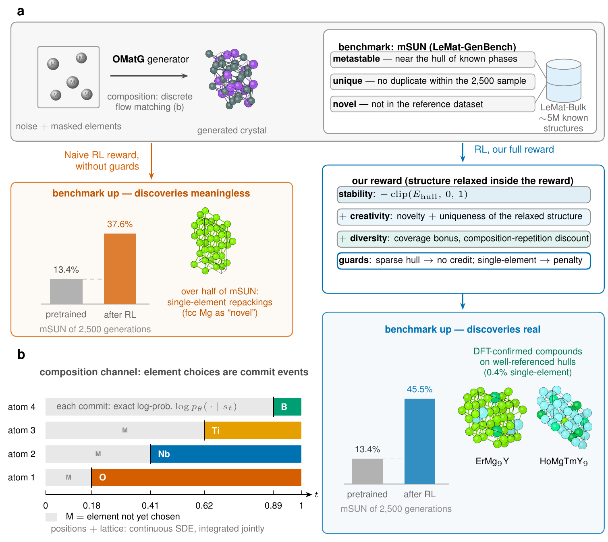

# OMatGRPO (branch reward-hacking)

This branch is the code of `main` plus the reward variants that the paper's reward-hacking appendix studies. They
are described in [docs/reward_hacking_variants.md](docs/reward_hacking_variants.md). For the paper's main runs, use
[`main`](https://github.com/paprakash/OMatGRPO).

Code for *Reinforcement Learning on the Discrete Composition Channel of a Crystal Generator: Validated Gains and
Reward Hacking* by Pawan Prakash, Philipp Höllmer, Addis Fuhr, Peter Hirschfeld, P. Ganesh, Stefano Martiniani and
Richard Hennig.

[](#citation)
[](https://huggingface.co/paprakash/OMatGRPO)
[](LICENSE)

<p align="center">
  
</p>

*Figure 1 of the paper.* (a) Without guards, reinforcement learning raises mSUN from 13.4% to 37.6%, but over half
of that set is single-element repackings of known elements such as fcc Mg. With the full reward, mSUN reaches 45.5%
with 0.4% single-element structures. (b) Each atom's element is a discrete commit event with an exact
log-probability, which the policy gradient acts on.

## Overview

OMatGRPO fine-tunes a pretrained [OMatG](https://github.com/FERMat-ML/OMatG) model with group relative policy
optimization (GRPO). OMatG generates positions and the lattice with stochastic differential equations and the
elements with masked discrete flow matching. The policy gradient acts on all three channels, so reinforcement
learning also chooses the composition. The reward is minus the energy above the convex hull (E_hull) after
relaxation with the UMA potential, plus a creativity term for structures that are new with respect to MP-20 and a
bonus for compositional coverage. Guards withhold reward where the potential or the hull reference cannot be
trusted. Each guard closes an exploit that the policy found in an earlier version of the reward.

## Results

The paper evaluates 2,500 generated structures per model with LeMat-GenBench. mSUN is the share of the 2,500 that is
metastable, unique and novel.

| model | mSUN, % (count) | single-element structures in mSUN |
|---|---|---|
| pretrained OMatG (the prior) | 13.4 (336) | 7 |
| frozen-composition control | 9.8 (245) | 1 |
| reinforcement learning without the single-element guard (discovery) | 37.6 (939) | 502 |
| **OMatGRPO** | **45.5 (1138)** | **4** |

The frozen-composition control learns only positions and the lattice and stays below the prior, which shows that
large gains need reinforcement learning on the composition channel. Density functional theory agrees with the
potential on 63 of 67 spot-checked structures. The tables of every run are in
[docs/reproducing.md](docs/reproducing.md#results-of-all-runs).

## Installation

```bash
git clone https://github.com/paprakash/OMatGRPO && cd OMatGRPO
conda env create -f environment.yml
conda activate omatgrpo
pip install -e ".[dev]"
python scripts/download_assets.py               # the prior and the MP-20 LMDBs
python scripts/build_references.py mmd          # the two MP-20 references of the reward
python scripts/build_references.py creativity
```

The reward and the evaluation use the gated UMA potential (`facebook/UMA` on Hugging Face). Request access on its
page and log in once with `hf auth login`. Install OMatGRPO into a fresh environment, because an installed upstream
OMatG also provides a package named `omg`.

## Quick start

```bash
# train OMatGRPO
python -m omg.grpo.train --config configs/runs/arityguard_creatrelax.yaml

# generate 2,500 structures, relax them and export the valid ones as CIFs
python scripts/eval/generate.py --checkpoint outputs/arityguard_creatrelax/final_model.safetensors \
    --out_dir outputs/eval/arityguard_creatrelax --n 2500
python scripts/eval/export_cifs.py --run_dir outputs/eval/arityguard_creatrelax \
    --dest outputs/eval/arityguard_creatrelax/export

# score them with LeMat-GenBench and split mSUN into single-element and sparse-hull structures
export LEMAT_GENBENCH_ROOT=/path/to/lemat-genbench
scripts/eval/run_lemat_genbench.sh outputs/eval/arityguard_creatrelax/export/cifs arityguard_creatrelax
python scripts/eval/lgb_report.py --name arityguard_creatrelax \
    --cifs outputs/eval/arityguard_creatrelax/export/cifs \
    --summary outputs/eval/arityguard_creatrelax/export/structures_summary.csv
```

LeMat-GenBench runs in its own environment. Clone [lemat-genbench](https://github.com/LeMaterial/lemat-genbench),
check out commit `58e6eae3e4a6c87c22171cf069123ecc4e2fa7e6` and install it as its README describes.

To skip training, `python scripts/download_assets.py models` downloads the weights of all seven runs, for example
`omg/data/models/arityguard_creatrelax/final_model.safetensors`. `scripts/slurm/` has SLURM templates for the three
steps.

## Paper runs

Each file in `configs/runs/` holds every setting of one run in the paper. Flags on the command line override it,
and `--print_config` prints the resolved settings.

| run | paper name | change from OMatGRPO |
|---|---|---|
| `arityguard_creatrelax` | OMatGRPO | |
| `canonical_creatrelax` | discovery | `--single_element_guard off` |
| `sparseworst_creatrelax` | penalty routing | `--single_element_guard off --sparse_route penalty` |
| `arityguard` | guarded, pre-creativity | `--w_creat 0 --creat_on_relaxed false` |
| `canonical` | discovery, pre-creativity | `--single_element_guard off --w_creat 0 --creat_on_relaxed false` |
| `sparseworst` | penalty routing, pre-creativity | `--single_element_guard off --sparse_route penalty --w_creat 0 --creat_on_relaxed false` |
| `frozen_control` | frozen-composition control | learns only positions and the lattice, with one composition per group from the prior |

This branch adds the earlier reward variants that the paper's reward-hacking appendix studies. They have no files
in `configs/runs/`, and [docs/reward_hacking_variants.md](docs/reward_hacking_variants.md) gives their commands.

## Documentation

| page | contents |
|---|---|
| [docs/reward.md](docs/reward.md) | the GRPO loss, the reward and each guard with the flag that turns it off |
| [docs/reproducing.md](docs/reproducing.md) | assets, the prior, evaluation protocol, tables of all runs, compute, outputs, limitations and tests |
| [docs/flags.md](docs/flags.md) | every command-line flag of `omg.grpo.train` |
| [docs/reward_hacking_variants.md](docs/reward_hacking_variants.md) | the reward variants of the reward-hacking appendix and their commands |

## License

OMatGRPO is MIT licensed. The `omg` package is a copy of OMatG (MIT) at commit
[`9172203`](https://github.com/FERMat-ML/OMatG/tree/9172203a9026af41732247cc62aaf4d903010e9c), extended by
`omg/grpo/` and three changed files that [docs/reproducing.md](docs/reproducing.md#relation-to-omatg) lists. The
creativity term uses the `average-minimum-distance` package, whose license is CC BY-NC-SA 4.0, so its
non-commercial terms apply to every run with `--w_creat > 0`. [THIRD_PARTY_NOTICES.md](THIRD_PARTY_NOTICES.md)
lists the other code, models and data this project uses and their licenses.

## Citation

Please cite the paper and OMatG.

```bibtex
@article{prakash2026omatgrpo,
    title={Reinforcement Learning on the Discrete Composition Channel of a Crystal Generator: Validated Gains
    and Reward Hacking},
    author={Pawan Prakash and Philipp H{\"o}llmer and Addis Fuhr and Peter Hirschfeld and P. Ganesh and
    Stefano Martiniani and Richard Hennig},
    journal={arXiv link coming soon},
    year={2026},
}

@inproceedings{hoellmer2025,
    title={Open Materials Generation with Stochastic Interpolants},
    author={Philipp H{\"o}llmer and Thomas Egg and Maya Martirossyan and Eric
    Fuemmeler and Zeren Shui and Amit Gupta and Pawan Prakash and Adrian
    Roitberg and Mingjie Liu and George Karypis and Mark Transtrum and Richard
    Hennig and Ellad B. Tadmor and Stefano Martiniani},
    booktitle={Forty-second International Conference on Machine Learning},
    year={2025},
    url={https://openreview.net/forum?id=gHGrzxFujU},
    archivePrefix={arXiv},
    eprint={2502.02582},
    primaryClass={cs.LG},
}
```
